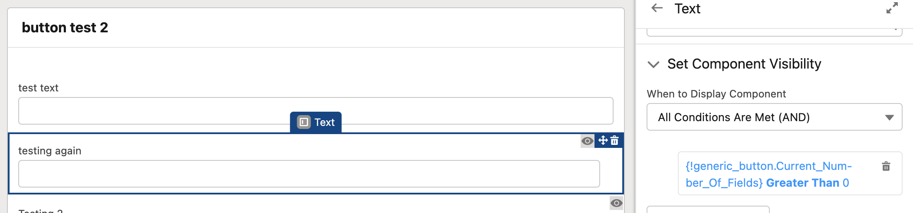
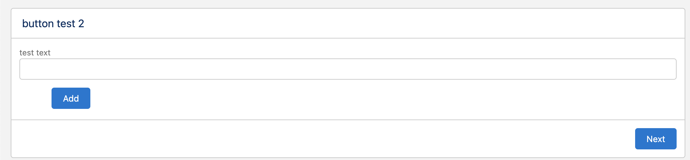
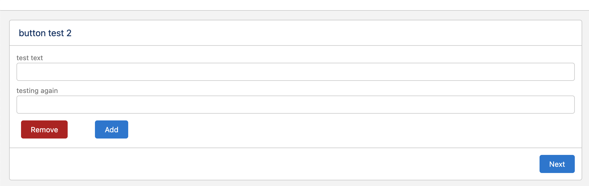
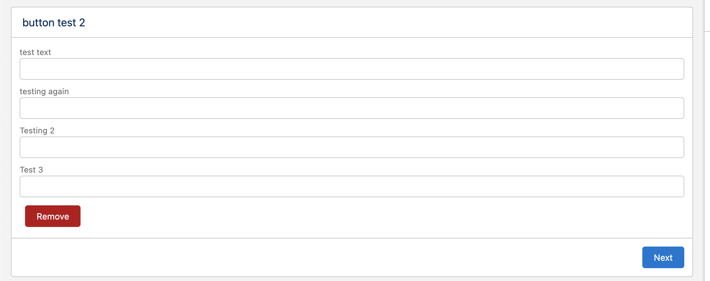

# Increment And Add Button

This component is used to increment and decrement a variabe which can be used to show other components using condotional rendering in screen flows.
## Component Variables

Add_Button_Label : This variable is used for the label for incrementing button

Remove_Button_Label : This variable is used for the label for decrementing button

Current_Number_Of_Fields : This variable is the one that gets incremented and decremented when using the buttons so this one should be used in the conditional rendering of the other components and also a initial value can be used as a input but if left empty the initial value of the variable will be 0

Maximum_Number_Of_Fields : This variable is the maximum number that the Current_Number_Of_Fields can reach after it reaches this value the add button will be hidden.

## Demo 

First we will add the component and we will set the conditional rendering for the component we want to add/remove. As shown below the first form will only be visible when the Current_Fields_Numbers above 0 so initiially it will be hidden 

The other fields will have the same condition but instead of 0 the second component will be 1 and the third component will be 2. 

Since we only want the buttons to control 3 components so we will set the Maximum_Number_Of_Fields to 3 .

When starting the screen the inital screen will show just the add button and the remove button will be hidden since there are no components visible 
 

After pressing add the first component will now be visible and the remove button will also be visible so the component can be removed again if the user wanted

And after adding the maximum number of fields that was defined in the input the add button will not be visible to the user as shown below 

https://githubsfdeploy.herokuapp.com/app/githubdeploy/MohamedTarekDG/LWC-Add-Remove-Buttons
